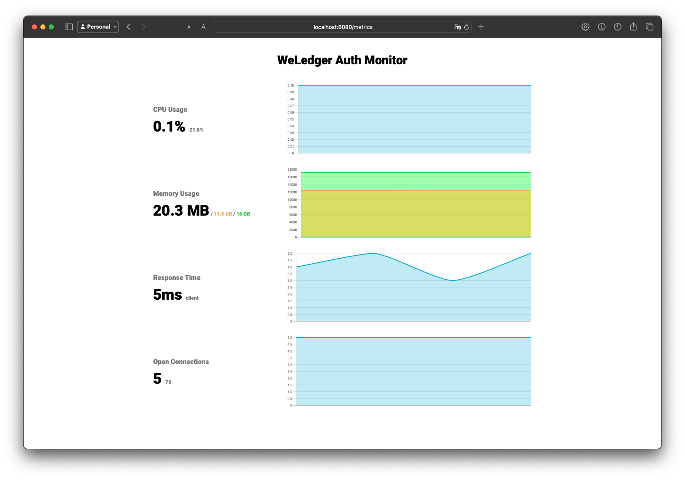

# Go Docker Hub

A simple API and automatic Docker Hub image refresh with Go

## Installation

Pull this repo and follow the steps below

```bash
  git clone https://github.com/WeLedger/wl-auth.git
  cd wl-auth
```

For development, run the following commands
```bash
  # Run the database
  make dev-up
  
  # Run the API
  make dev-run
```

For production
```bash
  make up
```

## Metrics
> http://localhost:8080/metrics



## Swagger API Reference

> http://localhost:8080/swagger/index.html